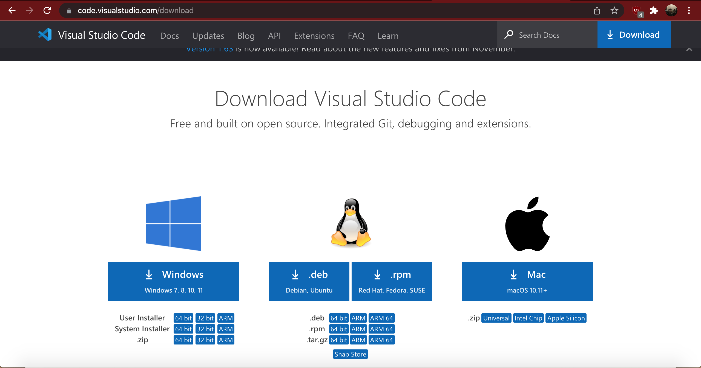
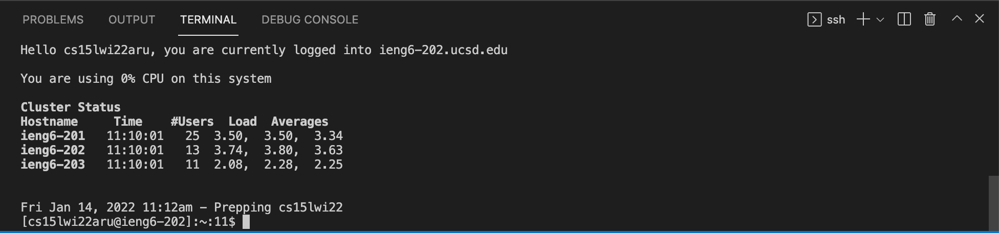
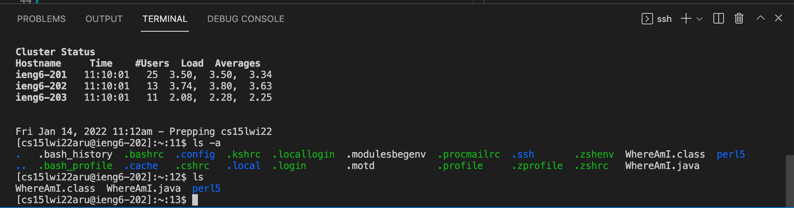
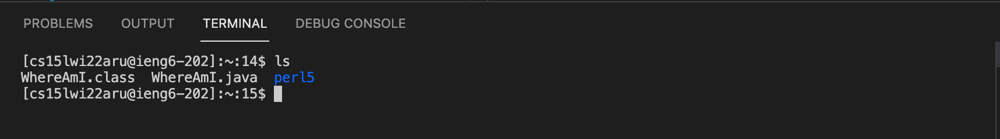
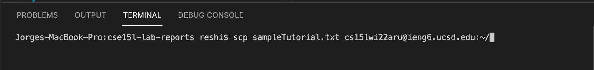
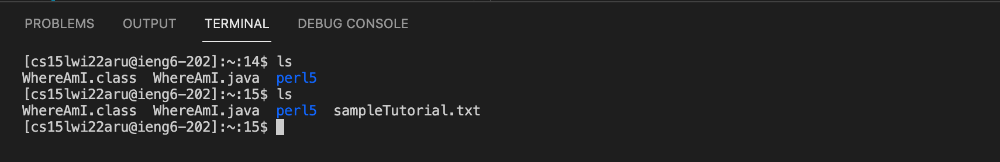
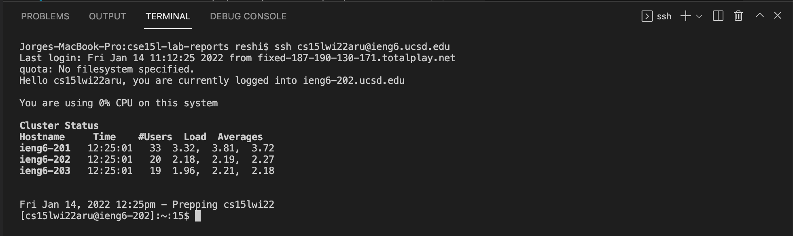
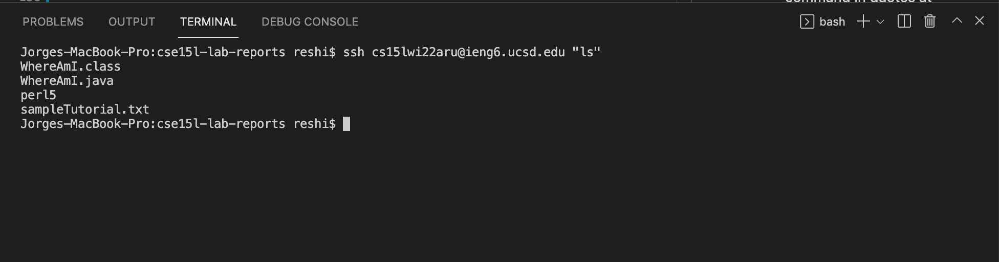

# Lab Report 1 <br />
## Logging into an ieng6  account <br />
<br />


**Downloading and installing VSCode** <br />
<br />
The first step is to download and install VSCode. Go to [the VSCode website](https://code.visualstudio.com/download) and choose the version that is compatible with your machine. Then follow the instructions to install.

 <br />


**Remotely Connecting** <br />
<br />
*First step for Windows users only: install a program called OpenSSH.* <br />
 <br />
1. After installing VSCode, go to [this site](https://sdacs.ucsd.edu/~icc/index.php)  and look up your CSE15L course-specific account.

2. Open a terminal in VSCode and input this command (with the *zz* replaced by the letters in your account) :

   `$ ssh cs15lwi22zz@ieng6.ucsd.edu`
3. Type yes to the prompt that follows and input your password to log in 

4. Once you are logged in, you should see something like this:

 <br />
<br />

**Sample commands** <br />

Now that you are logged in, you can try running some commands. Here are some for you to try:

* **cd**: change directory to the home directory
* **ls**: lists the files in the current directory
* **ls -a**: lists ALL files in the current directory (files starting with ".")
* **mkdir *name_of_directory***: creates a directory
* **pwd**:  prints the path of the current directory
* **cp *Source_file* *Destination_file***: copies the contents of source file into destination file.

For example, running the `ls -a` and `ls` commands:


>Note that `ls` lists less files than `ls -a `

<br />


**Moving Files with `scp`**

To copy a file from your machine to the server, we will use this command:

`scp FileName.extension cs15lwi22zz@ieng6.ucsd.edu:~/`

Replacing *FileName.extension* with the desired file name and *zz* with your account's specific letters. You will need to enter your password after entering the command.

For example, we will copy *sampleTutorial.txt*:


>Listing the files before copying *sampleTutorial.txt*

<br />


>This is how the command looks in this particular example

<br />


>After copying. We can see that *sampleTutorial.txt* is now listed

<br />
<br />

**Setting an SSH Key**<br />
We will set up a SSH key so we don't have to type our password every time we log in or run the `scp` command.

On your computer (steps taken from  [the CSE15L website](https://ucsd-cse15l-w22.github.io/week/week1/)):
```
# on client (your computer)
$ ssh-keygen
Generating public/private rsa key pair.
Enter file in which to save the key (/Users/joe/.ssh/id_rsa): /Users/joe/.ssh/id_rsa
Enter passphrase (empty for no passphrase): 
Enter same passphrase again: 
Your identification has been saved in /Users/joe/.ssh/id_rsa.
Your public key has been saved in /Users/joe/.ssh/id_rsa.pub.
The key fingerprint is:
SHA256:jZaZH6fI8E2I1D35hnvGeBePQ4ELOf2Ge+G0XknoXp0 joe@Joes-Mac-mini.local
The key's randomart image is:
+---[RSA 3072]----+
|                 |
|       . . + .   |
|      . . B o .  |
|     . . B * +.. |
|      o S = *.B. |
|       = = O.*.*+|
|        + * *.BE+|
|           +.+.o |
|             ..  |
+----[SHA256]-----+
```

*Extra steps for windows users to follow 
[on this website](https://docs.microsoft.com/en-us/windows-server/administration/openssh/openssh_keymanagement#user-key-generation*)

Now we need to copy the public key to the .ssh directory of your user account on the server.

```
$ ssh cs15lwi22zz@ieng6.ucsd.edu
<Enter Password>
# now on server
$ mkdir .ssh
$ <logout>
# back on client
$ scp /Users/joe/.ssh/id_rsa.pub cs15lwi22@ieng6.ucsd.edu:~/.ssh/authorized_keys
# You use your username and the path you saw in the command above
```
You are now done setting up the keys and can log in or use other commands without having to input your password.

<br/>


>After following the previous steps, you can now log in without inputing the password!

<br/>


**Optimizing Remote Running**<br/><br/>
Lastly, here are some other useful tips to save time:
* You can write a command in quotes at the end of a ssh command to directly run it on the remote server, then exit.<br/>
`$ ssh cs15lwi22@ieng6.ucsd.edu "command"`
* You can use semicolons to run multiple commands on the same line in most terminals.<br/>
`$ command1; command2; command3`

For example, listing the home directory  of the remote server using the first tip:



We had to input around 30 keystrokes and the whole process took less amount of time than before, when we had to login, input the password, run a command and then logout, which may add an extra 10-20 keystrokes, depending on the password.

This ends the tutorial, thank you for reading!


	