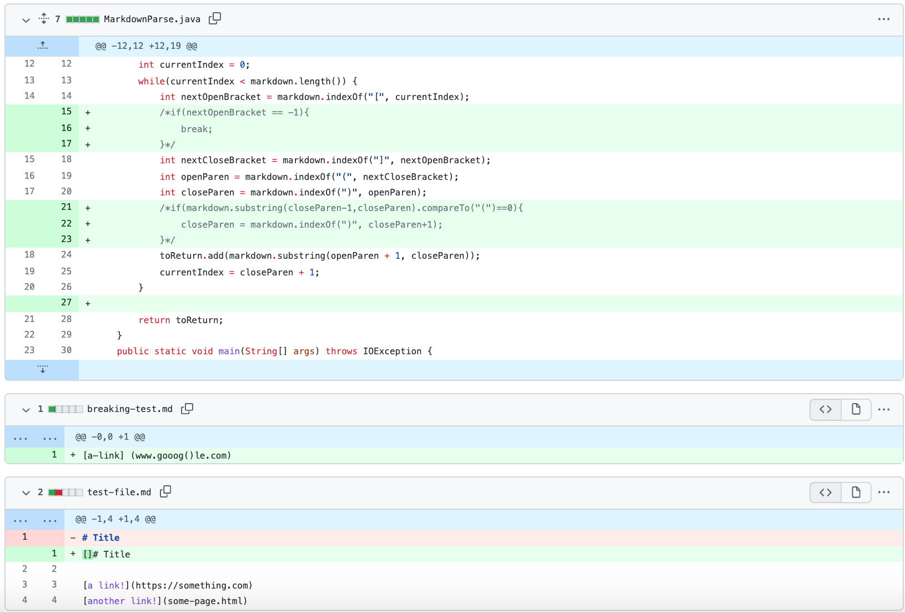
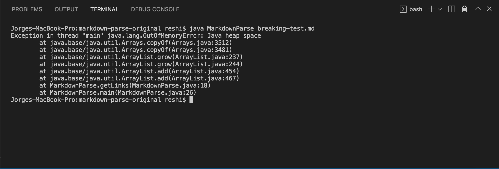
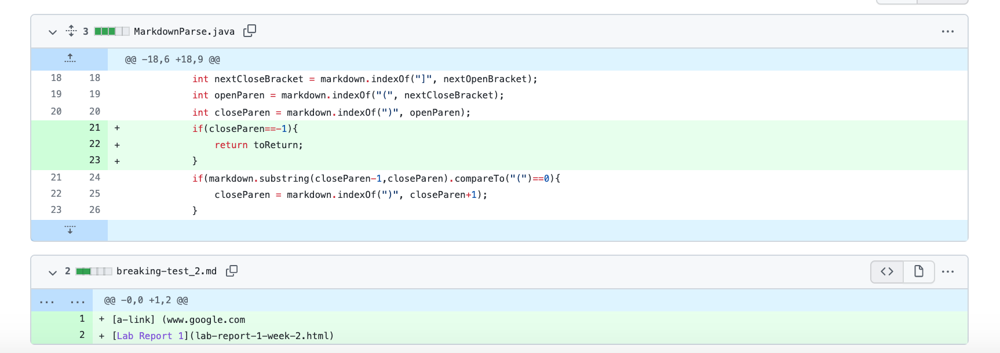
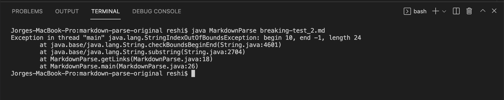
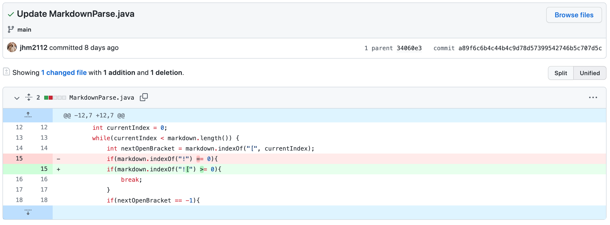
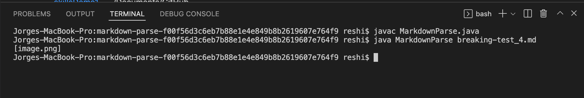

# Lab Report 2  
[Return to index](../index.md)

## Change 1  
 

  

 [Link to the test file that caused the error
](https://github.com/mlin1026/markdown-parse/blob/9d7c61b1041cd64e006a1696f28ad7beb8536540/breaking-test.md)

The output when testing the program before fixing the bug:

  

In this case, the bug was that the program didn't account for the fact that links may contain parenthesis and this caused an infinite loop with the sample input because of the way the program searched for links, it ended up not finding an index, and the program never terminated. The symptom of this bug was the error message that alerted that memory was all used up, due to the infinite loop.

## Change 2  
 

  

[Link to the test file that caused the error
](https://github.com/mlin1026/markdown-parse/blob/05a877c49cf8814a25ae876969eaa2731c25a638/breaking-test_2.md)

The output when testing the program before fixing the bug:

  

In this case, the bug is that the the program attempts to access an index of -1, since the last index was not found and the return value for that case is -1, and this caused the symptom of an index out of bounds exception. This happened because in the input file, no closing parenthesis is present for a link.

## Change 3  
 

 

  
[Link to the test file  that caused the error
](https://github.com/jhm2112/markdown-parse/blob/main/breaking-test_4.md)

The output when testing the program before fixing the bug:

  

In this case, the bug is that we have not defined the case in which we have image files inserted, which we don't want to include in the output, and the symptom is that the program prints out the image file names when we have them in the program tests.

