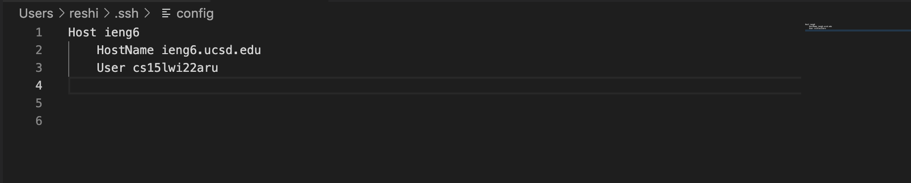
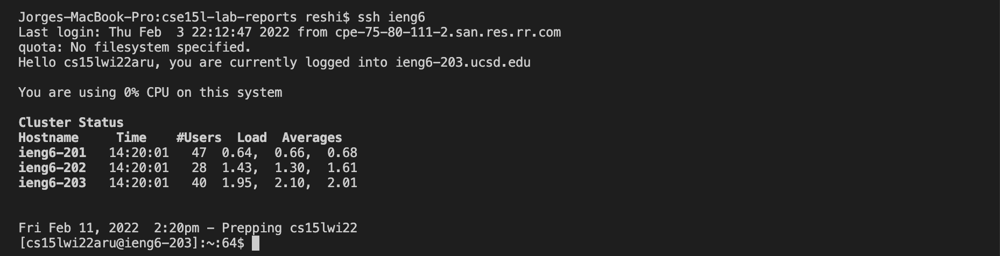
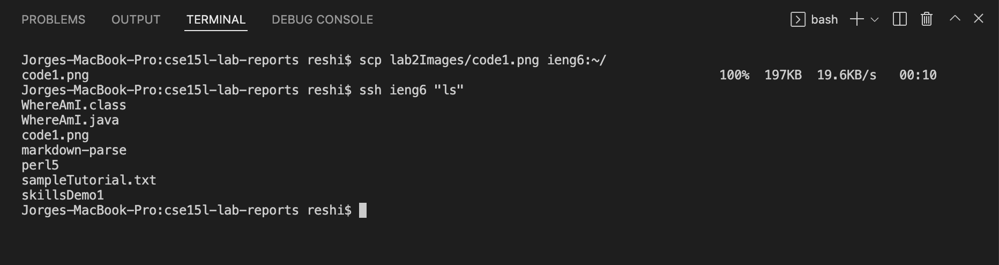

# Lab Report 3  
[Return to index](../index.md)
## Streamlining SSH configuration  
 

**Editing .ssh/config on VSCode:**

 
>Creating an alias is the first step in the process. In this case, ieng6 is the chosen alias.

**Log-in process using the new alias:**

  
>Now that we have an alias, logging into ieng6 takes considerably less time than before

**Demo of the scp command using the new alias:**

  
>As we can see, when we list the files with the `ls` command, "code1.png" gets printed.

