# Lab Report 4  
[Return to index](../index.md)
 
 
## More testing  
 

[Link to my copy of the reviewed repository](https://github.com/jhm2112/markdown-parse2)

[Link to my repository](https://github.com/jhm2112/markdown-parse)

**Snippet 1**

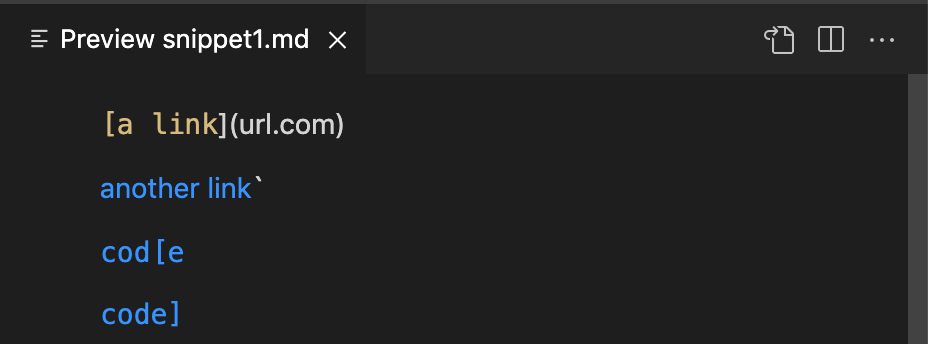 
 Based on the preview, we can see the first link is invalid and we have 3 valid links in the file. 

 **Test for snippet 1**

 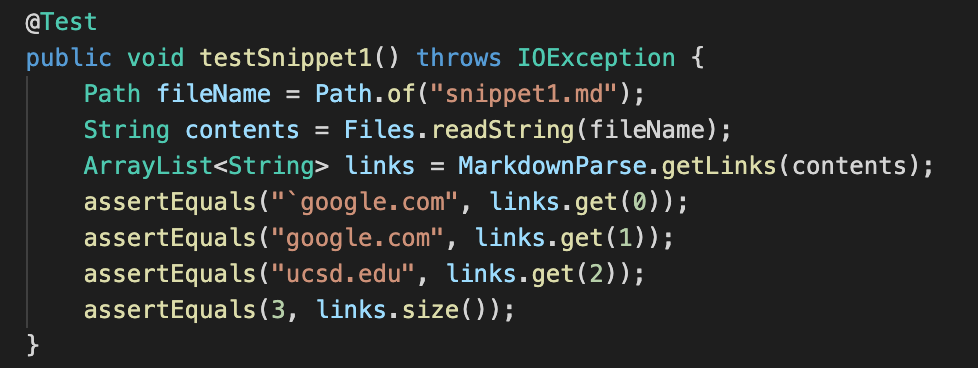 
 The test for snippet 1 checks that the 3 links were added and also checks the size of the array to ensure only 3 were added.

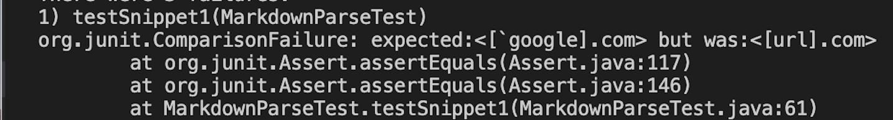 
When running the test in my own repo , the test failed because url.com, an invalid link, is added as the first link:

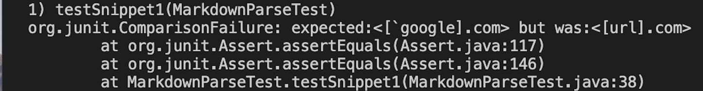 
When running the test in the reviewed repo, the test failed for the same reason as above.

**Snippet 2**
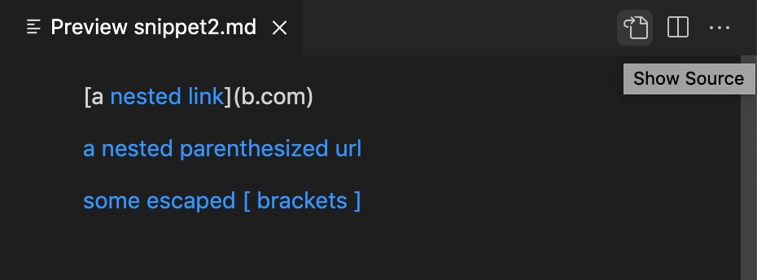 
Looking at the preview, we can see there are 3 valid links and that b.com is not a valid link. 

 **Test for snippet 2**
 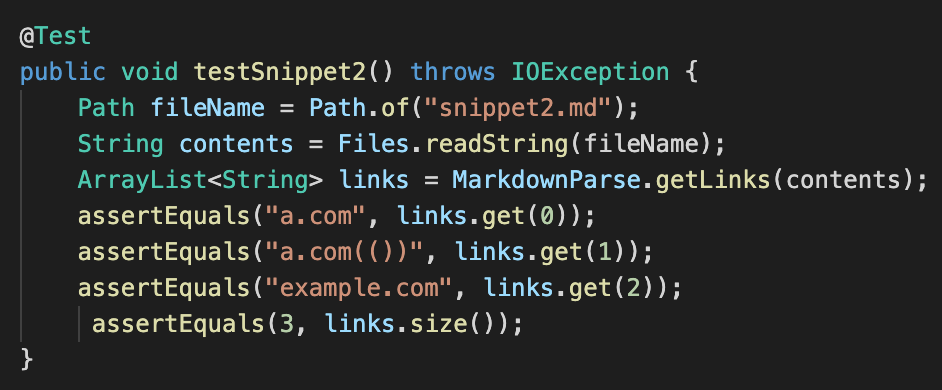 
 The test for snippet 2 checks that the 3 valid links were added and that the size of the array is 3.

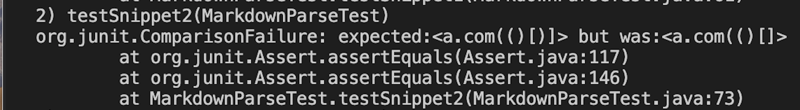 
 When running the test in my own repo, the test failed because a url was added to the array but it was missing a parenthesis.

When running the test in the reviewed repo, the test passed.

**Snippet 3**
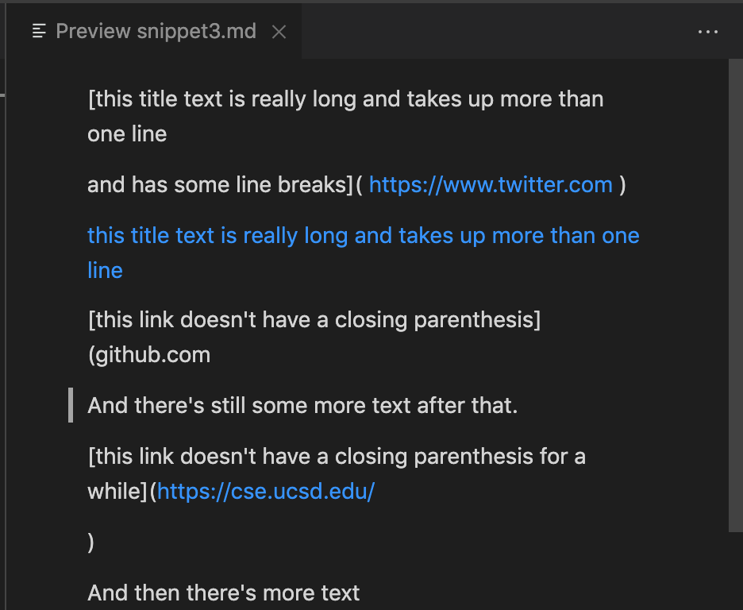 
Based on the preview, there is only one valid link that should be printed. 
 **Test for snippet 3**
 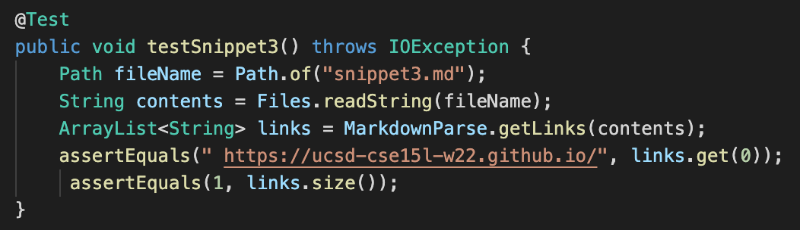 
 The test for snippet 3 checks that the valid link is added and that the size of the link array is 1.

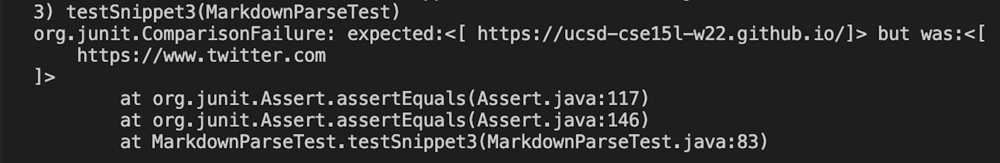 
The test fails because a link was added to the array even though that link had the wrong format.

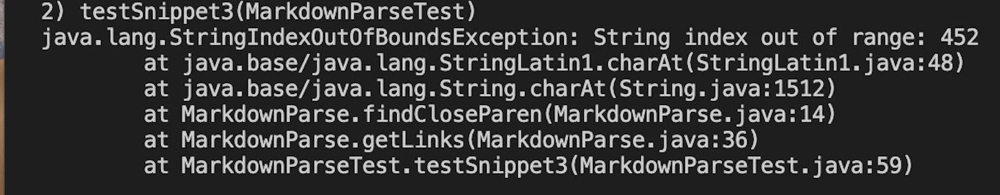 
The test fails because the findCloseParen method throws an index out of bounds exception.

**Do you think there is a small (<10 lines) code change that will make your program work for snippet 1 and all related cases that use inline code with backticks? If yes, describe the code change. If not, describe why it would be a more involved change.**  
*I think it can be fixed easily for this specific case but it will cause other errors since backticks may appear in other types of lines*  

**Do you think there is a small (<10 lines) code change that will make your program work for snippet 2 and all related cases that nest parentheses, brackets, and escaped brackets? If yes, describe the code change. If not, describe why it would be a more involved change.**  
*I think it would be a more involved case since we are dealing with parenthesis and we could have any number of pairs of parenthesis, sometimes inside a link and sometimes not part of the link* 

**Do you think there is a small (<10 lines) code change that will make your program work for snippet 3 and all related cases that have newlines in brackets and parentheses? If yes, describe the code change. If not, describe why it would be a more involved change.**  
*I think it could be an easy fix to check for empty lines on the file and if there are any, it is an invalid link* 