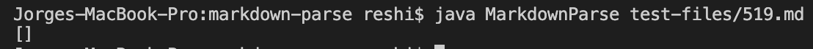

# Lab Report 5  
[Return to index](../index.md)
 
 
I found the test results manually. There were a lot of tests that didn't run with my implementation so I just decided to search manually instead of solving that problem.
## Test 1
 

The first test is 516.md. Here is the preview:

 
Based on the last two images, we can see there is a single link, /uri, which I checked by hovering over the link.
Here are the results from the two implementations:  
 

 
>Output for the Week 9 provided implementation

 
>Output for my implementation

The expected output is [/uri]. We can see that both outputs are wrong and this is due to the link being an image that links to the url, something we haven't encountered before.

For the week 9 code, this part of the code causes the bug:

 
Next close bracket, in this case, detects the close bracket of the image inside the link, so then the next open and close parenthesis are those belonging to the image and not to the /uri link. This is why we get [moon.jpg] instead of the desired result.

## Test 2
 

The second test is 519.md. Here is the preview:
 
Based on this preview, we see that there are no links present on the file. Here are the results from the two implementations:  
 

 
>Output for the Week 9 provided implementation

 
>Output for my implementation

The expected result is an empty list, so only the week 9 implementation gave the wrong input this time.
The problem with the implementation is that the code does not check for the case where we have an image. Here is another case where this same implementation gives the wrong output:

 
> The test file

 
> The results

In this other case we don't even have an image , but since the line starts with "!", it should automatically discard that portion of the string. My implementation has a check for that and it  passed the test.  A check for  the "!" character before the "[" should be inserted before line 57:

 

